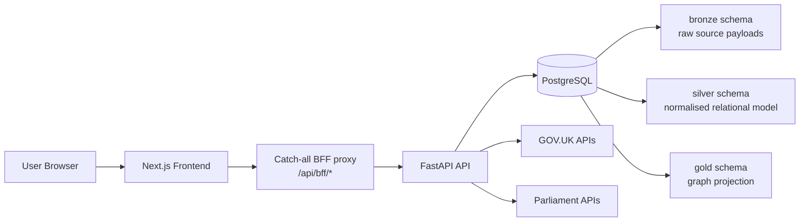
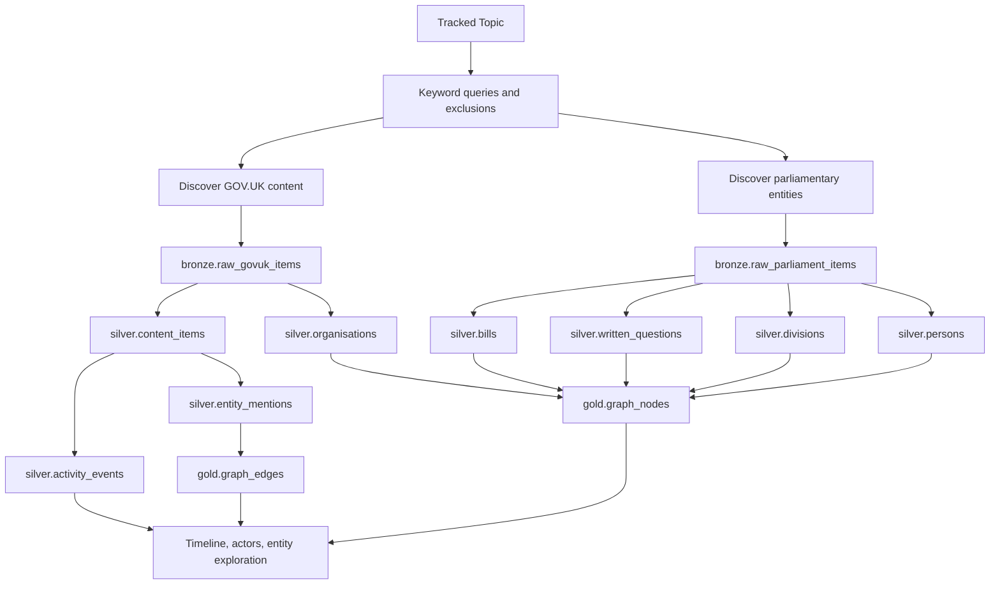
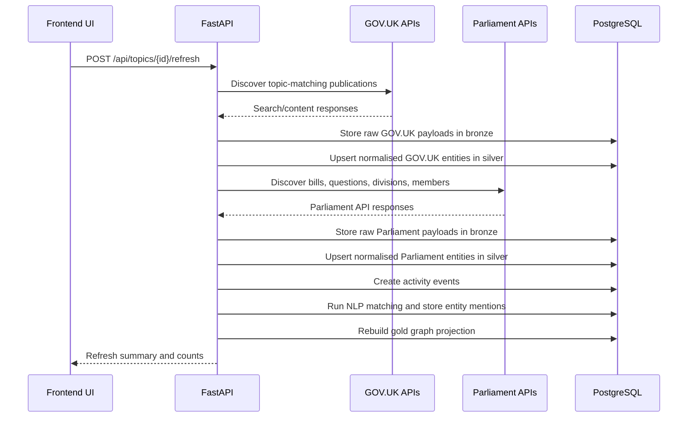

# UK Policy Tracker

UK Policy Tracker is a full-stack data product that links GOV.UK publications to parliamentary activity so a policy topic can be tracked in one place. It ingests raw source data from multiple public APIs, normalises it into a relational model, enriches it with NLP-based entity matching, and projects the result into a graph layer for exploration.

## Core Capabilities

- Create and manage tracked policy topics with keyword rules and exclusions
- Pull matching publications from GOV.UK and parliamentary activity from multiple Parliament APIs
- Materialise topic timelines spanning publications, bills, written questions, and divisions
- Track MPs and inspect their votes and written questions independently of topic tracking
- Identify key actors connected to a topic through entity extraction and graph projection
- Explore graph nodes and first-hop relationships through entity detail pages

## Technology Stack

### Backend

- Python 3.12
- FastAPI
- SQLAlchemy 2.x with async and sync session paths
- Alembic migrations
- PostgreSQL 16
- spaCy for NLP entity extraction
- httpx for upstream API clients

### Frontend

- Next.js 14 App Router
- React 18
- TypeScript 5
- TanStack React Query
- Tailwind CSS

### Runtime Services

- `postgres`: PostgreSQL 16 database
- `api`: FastAPI application and migration runner
- `frontend`: Next.js application
- `migrate`: optional one-off Alembic migration service

## Architecture At A Glance



### Service Startup Order

1. `postgres` starts first and exposes port `5432`
2. `api` waits for Postgres health, runs `alembic upgrade head`, then starts Uvicorn on port `8000`
3. `frontend` waits for a healthy API and starts on port `3000`
4. `migrate` is an optional tools-profile container for manual migrations

Database migrations are applied automatically on API startup, including upgrades against an existing persisted database volume.

## End-to-End Data Flow



## Topic Refresh Sequence

Topic refresh is synchronous by design. When a user clicks `Refresh Data`, the API process runs discovery, ingestion, event generation, entity matching, and graph rebuild in-process before returning.



## Database Architecture

The database is intentionally layered to separate ingestion concerns from analytical concerns.

| Schema | Purpose | Typical contents |
| --- | --- | --- |
| `bronze` | Immutable-ish raw landing zone for source payloads | Raw JSON payloads from GOV.UK and Parliament APIs with fetch metadata |
| `silver` | Normalised relational model used by the application and refresh pipeline | Topics, content items, organisations, persons, bills, questions, divisions, events, mentions |
| `gold` | Graph-oriented projection for connected-entity exploration | Graph nodes and graph edges built from silver relationships |

### Bronze Schema

The bronze layer captures source payloads before business transformation.

| Table | Purpose |
| --- | --- |
| `bronze.raw_govuk_items` | Stores GOV.UK raw JSON by `base_path` with fetch metadata and source query |
| `bronze.raw_parliament_items` | Stores Parliament raw JSON keyed by `source_api` and `external_id` |

Why it matters:

- Preserves source-of-truth payloads for replay and debugging
- Makes transformations auditable
- Decouples upstream API volatility from downstream application logic

### Silver Schema

The silver layer is the canonical relational model used by the API and the pipeline.

#### Core entities

| Table | Role |
| --- | --- |
| `silver.topics` | Tracked policy topics, search queries, keyword groups, excluded keywords, refresh metadata |
| `silver.content_items` | Normalised GOV.UK publications linked back to raw items |
| `silver.organisations` | GOV.UK publishing organisations |
| `silver.persons` | Parliament members, including tracked-member state |
| `silver.bills` | Parliamentary bill metadata |
| `silver.written_questions` | Written question metadata, answer text, and answer source URL |
| `silver.divisions` | Commons division metadata and counts |
| `silver.activity_events` | Unified timeline events synthesised from ingested entities |
| `silver.division_votes` | Per-member voting records for divisions |

#### Relationship tables

| Table | Role |
| --- | --- |
| `silver.content_item_topics` | Links GOV.UK content to topics |
| `silver.bill_topics` | Links bills to topics |
| `silver.question_topics` | Links written questions to topics |
| `silver.division_topics` | Links divisions to topics |
| `silver.content_item_organisations` | Links publications to publishing organisations |
| `silver.entity_mentions` | Stores resolved NLP entity mentions extracted from GOV.UK content |

Why it matters:

- Converts heterogeneous API payloads into a stable internal contract
- Makes the product queryable without depending on raw JSON traversal
- Supports both operational endpoints and analytical enrichment workflows

### Gold Schema

The gold layer is a graph projection built from the relational layer.

| Table | Purpose |
| --- | --- |
| `gold.graph_nodes` | One node per materialised entity with label and JSON properties |
| `gold.graph_edges` | Typed relationships between nodes with optional JSON properties |

Why it matters:

- Supports connected-entity exploration in the UI
- Makes key-actor and relationship queries simpler than pure relational traversal
- Separates graph serving concerns from ingestion and normalisation concerns

## How The Backend Works

### 1. API Layer

The FastAPI application exposes a focused API surface under `/api`.

- `health`: liveness and source freshness checks
- `topics`: topic CRUD, timeline retrieval, actor queries, and refresh orchestration
- `members`: member search, tracking, vote history, question history, and refresh
- `entities`: graph node lookup and source-entity lookup

The application enables CORS for the frontend and serves OpenAPI docs automatically at `/docs`.

### 2. Dual Database Session Strategy

The backend uses two SQLAlchemy engine/session paths against the same PostgreSQL database:

- Async engine and `AsyncSession` for FastAPI request handling
- Sync engine and `Session` for longer-running local refresh operations

This split keeps the API layer idiomatic for async web traffic while allowing the ingest pipeline to use simpler synchronous control flow.

### 3. Refresh Orchestration

`run_topic_refresh(topic_id)` orchestrates the pipeline in five stages:

1. Ingest GOV.UK content for the topic
2. Ingest Parliament entities for the topic
3. Create timeline activity events
4. Run spaCy-based entity matching
5. Rebuild the graph projection

`run_all_topic_refreshes()` loops over global topics and executes the same pipeline for each one.

### 4. Ingestion And Normalisation

The ingestion layer is responsible for turning source payloads into structured entities.

#### GOV.UK ingestion

- Discovers topic-relevant content via search/content APIs
- Stores raw responses in `bronze.raw_govuk_items`
- Upserts structured publications into `silver.content_items`
- Associates publications with organisations and tracked topics

#### Parliament ingestion

- Discovers bills, members, written questions, and divisions relevant to a topic
- Stores raw responses in `bronze.raw_parliament_items`
- Upserts structured entities into the relevant silver tables
- Associates parliamentary entities with topics for later timeline and graph use

Each item-level ingest step runs inside a savepoint so one bad upstream record does not abort the whole refresh.

### 5. Activity Event Synthesis

The application generates `silver.activity_events` after ingestion so the frontend can query a consistent timeline abstraction rather than unioning multiple domain tables at request time.

This is a strong engineering choice because it pushes heterogeneity into the pipeline instead of into the UI or API consumers.

### 6. NLP Entity Matching

The NLP layer uses spaCy to extract and resolve entities from GOV.UK content.

- Loads a configurable spaCy model via `SPACY_MODEL`
- Enriches the model with bill titles and person names through pattern loading
- Extracts mentions from content text
- Resolves mentions against silver-layer entities
- Stores resolved results in `silver.entity_mentions`

This enrichment step is what turns a collection of documents into a connected dataset rather than a set of isolated source records.

### 7. Graph Projection

The graph builder truncates and rebuilds the gold layer from silver relationships.

The projection is then used to:

- Return detailed entity pages with first-hop connections
- Compute key actors for a topic
- Power graph-style navigation in the frontend

## API Overview

### Health

- `GET /api/health`: returns application status, DB connectivity, and latest bronze-layer fetch timestamps

### Topics

- `GET /api/topics`: list topics
- `POST /api/topics`: create a topic
- `GET /api/topics/{topic_id}`: fetch a single topic
- `PATCH /api/topics/{topic_id}`: update a topic
- `DELETE /api/topics/{topic_id}`: delete a topic
- `GET /api/topics/{topic_id}/timeline`: query timeline events with pagination and filters
- `GET /api/topics/{topic_id}/actors`: return connected actors for a topic
- `POST /api/topics/{topic_id}/refresh`: run a full synchronous topic refresh
- `POST /api/topics/refresh-all`: refresh all global topics

### Members

- `GET /api/members/search`: search Parliament members by name
- `GET /api/members`: list tracked members
- `GET /api/members/{parliament_id}`: member summary
- `POST /api/members/{parliament_id}/track`: track an MP or peer
- `DELETE /api/members/{parliament_id}/track`: untrack a member
- `GET /api/members/{parliament_id}/votes`: paginated voting history
- `GET /api/members/{parliament_id}/questions`: paginated written questions history
- `POST /api/members/{parliament_id}/refresh`: refresh one tracked member
- `POST /api/members/refresh-all`: refresh all tracked members
- `GET /api/members/divisions/{division_id}`: division detail

### Entities

- `GET /api/entities/{node_id}`: graph node detail and connected nodes
- `GET /api/entities/by-source/{entity_type}/{entity_id}`: entity lookup by source identity

## Frontend Architecture

The frontend is a Next.js App Router application that acts as the presentation layer over the backend.

### Notable frontend design choices

- Uses a catch-all BFF proxy route so the browser talks to Next.js rather than directly to the backend
- Uses TanStack React Query for typed data fetching, cache invalidation, and refresh-driven UI updates
- Uses TypeScript interfaces for API responses and UI state
- Exposes topic, member, and entity workflows as first-class pages rather than demo screens

### Main user flows

#### Topic tracking

- Create topics with search queries, keyword groups, and excluded keywords
- Trigger topic refresh to ingest and enrich fresh data
- Browse a unified timeline across publications and parliamentary activity

#### Timeline exploration

- Filter by date range, event type, source entity type, and search text
- Page through events without forcing the UI to understand source-table complexity

#### Entity exploration

- Open entity pages derived from the graph projection
- Inspect node properties and first-hop connections

#### Member tracking

- Search Parliament members by name
- Track specific MPs or peers
- View their votes and written questions independently of topic-level tracking

## Project Structure

```text
.
├── backend/
│   ├── alembic/
│   ├── app/
│   │   ├── models/
│   │   ├── nlp/
│   │   ├── routers/
│   │   ├── schemas/
│   │   ├── services/
│   │   └── tasks/
│   └── tests/
├── frontend/
│   └── src/
│       ├── app/
│       ├── components/
│       ├── hooks/
│       └── lib/
├── docker-compose.yml
└── README.md
```

## Quick Start With Docker

### Requirements

- Docker Desktop or Docker Engine with `docker compose`

### 1. Create the environment file

```powershell
Copy-Item .env.example .env
```

### 2. Build and start the stack

```powershell
docker compose up --build
```

### 3. Open the application

- Frontend: http://localhost:3000
- API docs: http://localhost:8000/docs
- API health: http://localhost:8000/api/health

### 4. Seed the workflow manually

1. Create a topic from the home page
2. Open the topic detail page
3. Trigger `Refresh Data`
4. Inspect the timeline, actors, and connected entities

## Docker Operations

Start in the background:

```powershell
docker compose up --build -d
```

Check running services:

```powershell
docker compose ps
```

Stop the stack:

```powershell
docker compose down
```

Stop the stack and delete persisted database data:

```powershell
docker compose down -v
```

Rebuild one service:

```powershell
docker compose build api
docker compose build frontend
```

View logs:

```powershell
docker compose logs -f api
docker compose logs -f frontend
docker compose logs -f postgres
```

Run migrations manually with the tools profile:

```powershell
docker compose --profile tools run --rm migrate
```

## Local Development Without Docker

You will need PostgreSQL 16+ running separately and a populated `.env` file.

### Backend

```powershell
cd backend
pip install -e ".[dev]"
python -m spacy download en_core_web_sm
alembic upgrade head
uvicorn app.main:app --reload --port 8000
```

### Frontend

```powershell
cd frontend
npm install
npm run dev
```

## Environment Configuration

The defaults in [.env.example](.env.example) are suitable for the Docker workflow in this repository.

### Core variables

- `POSTGRES_DB`
- `POSTGRES_USER`
- `POSTGRES_PASSWORD`
- `DATABASE_URL`
- `DATABASE_URL_SYNC`
- `CORS_ALLOWED_ORIGINS`
- `API_PROXY_TARGET`
- `SPACY_MODEL`

### External API variables

- `GOVUK_BASE_URL`
- `PARLIAMENT_MEMBERS_API_URL`
- `PARLIAMENT_BILLS_API_URL`
- `PARLIAMENT_QUESTIONS_API_URL`
- `PARLIAMENT_DIVISIONS_API_URL`

## Migrations

Alembic manages schema evolution for the three-layer PostgreSQL model.

Notable migrations in the repository show how the schema evolved as the product matured:

- initial multi-schema setup for bronze, silver, and gold
- GOV.UK identifier length expansion
- topic-scoped Parliament linking
- question answer storage
- keyword rule support on topics
- tracked-member support for MP workflows

Because the API container runs `alembic upgrade head` on startup, the default Docker path applies migrations automatically.

## Testing And Validation

### Backend tests

```powershell
cd backend
pytest -q
```

The backend test suite covers:

- upstream API clients
- ingestion and upsert logic
- graph projection and graph queries
- API routers
- schemas and task orchestration

### Frontend validation

```powershell
cd frontend
npm run build
```

This is currently the main frontend smoke check in the repository.

## Operational Notes

### Health checks

- `GET /api/health` verifies DB connectivity
- The same endpoint reports the latest bronze-layer fetch timestamps for GOV.UK and Parliament data
- Docker uses the health endpoint to gate frontend startup behind a healthy API

### Current runtime model

- Refresh is synchronous and runs inside the API process
- There is no queue worker, scheduler, or background task system in the current repository root
- The frontend talks to the backend through a BFF proxy route configured by `API_PROXY_TARGET`